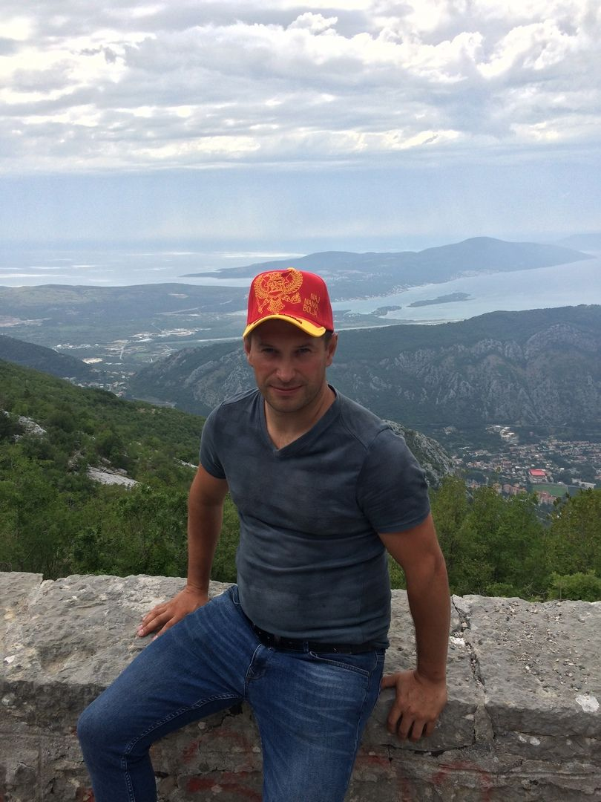

[rsschool-cv](https://nikolay16031982.github.io/rsschool-cv/cv)
# Nikolay Kuzmichev


## Personal data
* Born on March 16, 1982 in the city of Slutsk
* I live in the city of Slutsk
* Contact phone: +375447623097
## About myself
I teach radar technology at a military university in the Republic of Belarus. In addition to teaching, I am engaged in scientific activities. Currently I am working on my Ph.D. thesis related to the adaptation of radar angle meters to the polarization of the received signal. Of the achievements, I can note the deep knowledge of the BUK air defense system, knowledge of digital technology, probability theory and matrix apparatus, a trip by sea from Belarus to Montenegro in a private car. In my free time I like to relax in nature, I am fond of spearfishing and fishing. I have a golden retriever named Gera.

## Skills
In my work I actively use such tools as the C++ programming language, the MathCad mathematical package, the CST Macroweve Studio microwave modeling environment. In my free time, I study the JavaScript programming language. Currently I have a basic knowledge of HTML, CSS, Git, JavaScript, React, Type Script and Node JS. At the moment I am working on the transition to a higher level of proficiency in these technologies. I have knowledge of English at the level A1-A2 and I am working on its improvement.
  
## Code examples
```function rot13(message){
  //your code here
  let tempArr = message.split("").map((simb) => {
    let code = simb.charCodeAt();
    if ((code > 64 && code < 78) || (code > 96 && code < 110)) code = code + 13;
    else if ((code > 77 && code < 91) || (code > 108 && code < 123)) code -= 13;
    return String.fromCodePoint(code); //   ;
  });
  return tempArr.join("");
}
```
## work experience
I have extensive experience in modeling radar stations in C ++ while serving in the Armed Forces of the Republic of Belarus. I have experience in developing digital devices based on microcontrollers designed to interface with a digital computer of BUK air defense systems in C ++.
## Education
1. 1988-1997 Secondary school number 10 of the city of Slutsk.
2. 1997-1999 Secondary school number 5 of the city of Slutsk.
3. 1999-2004 Faculty of Air Defense Educational Institution "VA RB".
4. 2013-2015 Command and staff faculty of the educational institution "VA RB".
5. 2016-2017 Full-time adjuncture of the educational institution "VARB" in the specialty of radar and radio navigation.
6.I am currently studying Java Script and Node JS at RS Scool.
